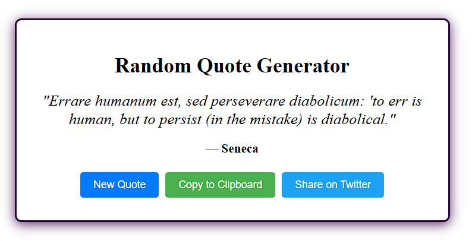

# 🧠 Random Quote Generator

A minimal and elegant web app that fetches **stoic quotes** from an API and lets you copy or share them instantly!



---

## 🚀 Features

- 🔄 Fetches a new quote with a click
- 📋 Copy quote to clipboard
- 🐦 Share quote on Twitter
- ⚡ API-powered (stoic-quotes.com)
- 💡 Uses React + useEffect + async/await
- 🎨 Responsive, clean UI

---

## 🛠️ Tech Stack

- React
- JavaScript (ES6)
- HTML / CSS
- Stoic Quotes API ([https://stoic-quotes.com/api/quote](https://stoic-quotes.com/api/quote))

---

## 📦 Getting Started

Clone the repo and run the app locally:

```bash
git clone https://github.com/your-username/quote-generator.git
cd quote-generator
npm install
npm start

---

## 📝 License

[](https://opensource.org/licenses/MIT)

This project is licensed under the **MIT License**.

You are free to use, modify, and distribute this project — even for commercial purposes — as long as you:

- Include the original copyright
- Include the license text
- Do not hold the author liable for any damages

> See the full license in the [LICENSE](LICENSE) file.


